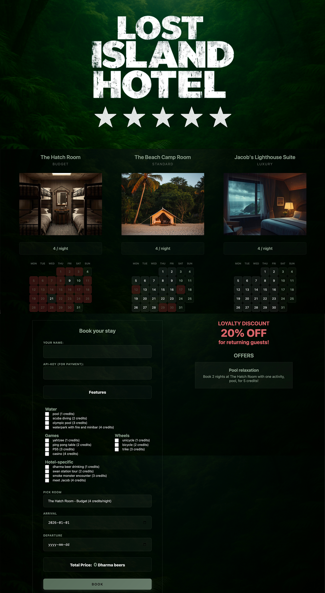
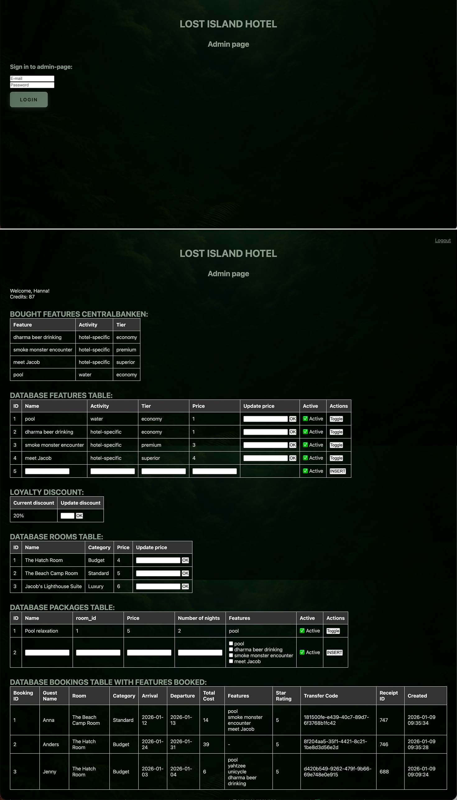

# Yrgopelag – Lost Island Hotel

**Live site:** https://hannajohansson01.se/yrgopelag/

A hotel booking system for a fictional island, built as a school project at the end of the first semester, December 2025 – January 2026. Inspired by the TV series LOST.

---

## About the project

A fullstack web application where visitors can book one of three hotel rooms (budget, standard, luxury) for specific dates in January 2026. The system integrates with an external REST API (Central Bank of Yrgopelag) to validate and process payments via transfer codes.

The project includes a protected admin panel where the hotel manager can update room prices, discounts, package deals, and features, as well as view all bookings.

## Screenshots

<table>
  <tr>
    <td width="50%"><strong>Booking page</strong> </td>
    <td width="50%"><strong>Admin panel</strong> </td>
  </tr>
</table>

## Technologies

- **PHP** – backend logic and form handling
- **SQLite** – database for bookings, guests, features and payments
- **HTML / CSS** – frontend, desktop only
- **JavaScript** – dynamic price calculation, discount and package lookup (Fetch API, async/await)
- **Guzzle HTTP** – PHP HTTP client for Central Bank API integration
- **phpdotenv** – environment variable management

## Features

- Room availability calendar fixed to January 2026
- Real-time price calculation with discount and package detection
- Returning guest discount
- Package deals (room + selected features)
- Payment processed via external REST API (transfer code validation and deposit)
- Admin panel (login protected): manage prices, discounts, features and bookings
- Star rating display fetched from the Central Bank API

## Notes

Images were AI-generated using Canva.

## Code Review

As part of the course, students peer-reviewed each other's projects. The comments below were written by a fellow student as feedback on this codebase.

Code review:
•	Good use of gitignore, including the database
•	Good that you put some code in index.html and not just use require for all parts.
•	.env.example: an example could be added. 
•	Code in develop branch. This should be merged into main.
•	Assets- clear file structure for the scripts, css and image.
•	Css- Good use of variables, however the css file is quite long, could be divided into smaller parts.
•	Perhaps you can be a bit more consistent with comments in the code. Some files are well commented, but others very little.
•	The readability of the calendar dates could be improved, especially booked dates.
•	Index.php row.60 should probably be moved inside body-   <?php require __DIR__ . '/views/header.php'; ?> 

All things considered, a good and well structured project, well done!
